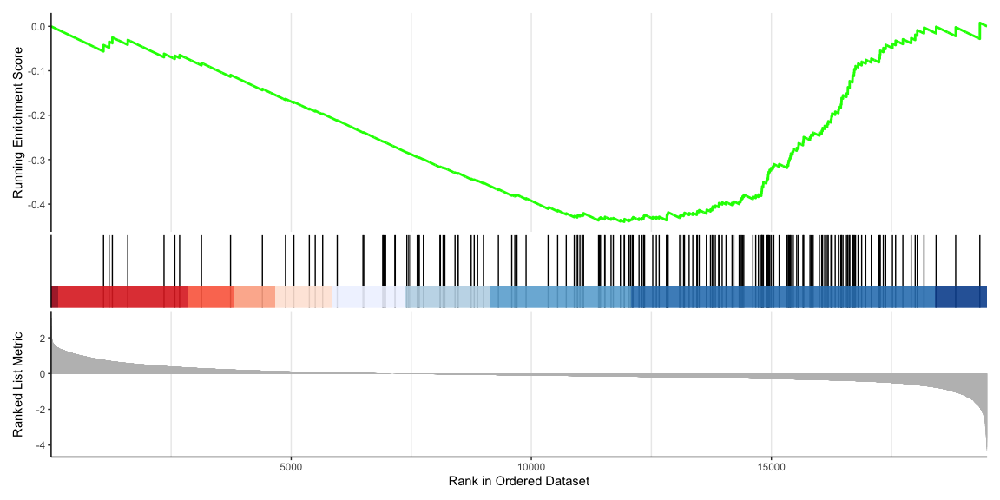

BTK and GSEA analysis
================
Kindle Zhang qz2527
2024-12-20

# make a DEG according to BTK gene expression

``` r
library(DESeq2)
counts_01A = read.table(
  "./data_file/counts01A.txt",
  sep = "\t",
  row.names = 1,
  check.names = F,
  stringsAsFactors = F,
  header = T
)
exp = read.table(
  "./data_file/tpms01A_log2.txt",
  sep = "\t",
  row.names = 1,
  check.names = F,
  header = T
)
identical(colnames(counts_01A),colnames(exp))
```

    ## [1] TRUE

``` r
gene = "BTK"
med = median(as.numeric(exp[gene, ]))

conditions =
  data.frame(sample = colnames(exp),
             group = factor(ifelse(exp[gene,] > med, "high", "low"), levels = c("low", "high"))) |>
  column_to_rownames("sample")

dds = DESeqDataSetFromMatrix(countData = counts_01A,
                             colData = conditions,
                             design = ~ group)
# dds = DESeq(dds)
# resultsNames(dds)

# res = results(dds)
# save(res,file="./data_file/DEG_BTK.Rda")
```

``` r
load("./data_file/DEG_BTK.Rda")
```

# GSEA(Gene Set Enrichment Analysis)

``` r
#BiocManager::install('clusterProfiler')
#BiocManager::install('org.Hs.eg.db')
library(org.Hs.eg.db) #org.Hs.eg.db包主要注释基因:用于不同数据库ID间的转化
library(clusterProfiler)
DEG <- as.data.frame(res)%>% arrange(padj) 

DEG <- DEG %>% rownames_to_column("Gene") 
# of course the BTK is most significant gene

geneList = DEG[,3]
names(geneList) = as.character(DEG[,'Gene'])
head(geneList)
```

    ##      BTK     MNDA  NCKAP1L     CD33    SCIMP    SASH3 
    ## 1.540796 1.678108 1.468309 1.546856 1.594062 1.414286

``` r
geneList = sort(geneList, decreasing = TRUE)
head(geneList)
```

    ##     PRB4    RXFP2      CLC  CEACAM8     AZU1   MCEMP1 
    ## 3.120753 2.672972 2.493237 2.244911 2.058411 2.058164

we don’t use go or kegg method this time. Instead, we use a GSEA this
time. (we don;t have to choose the cut off value for fold change)

GSEA use all genes to analyze, so we need to filter.

## use HALL

``` r
# GSEA基因集：https://zhuanlan.zhihu.com/p/504101161
# C1到C7是不同的基因集

msigdb_GMTs <- "msigdb_v7.0_GMTs"
msigdb <- "h.all.v7.0.symbols.gmt"    
#读取上面指定的gmt文件
kegmt <- read.gmt(file.path("./data_file", msigdb_GMTs, msigdb))
# 直接用symbols就行，之前go和kegg转换成id损失了一些基因
```

``` r
set.seed(1) # set seed
gsea <-GSEA(geneList,TERM2GENE = kegmt) #GSEA分析
#转换成数据框
gsea_result_df <- as.data.frame(gsea)
# save(gsea,gsea_result_df,file = "./data_file/GSEA_BTK_h.all.rda")
# we have 29 diffierent functions or paths
# NES正的就是往上凸，负的就是往下凸

#绘图
#安装enrichplot
library(enrichplot)
#单个结果绘制
gseaplot2(gsea,1,color="red",pvalue_table = T)
```

<!-- -->

``` r
#多个结果绘制
#A
gseaplot2(gsea, geneSetID = c(1,2,3,4,5,6,8,10), subplots = 1:3)
```

<!-- -->

``` r
#B
gseaplot2(gsea, geneSetID = c(7,9,11,13,14,16,17), subplots = 1:3)
```

<!-- -->

``` r
gseaplot2(gsea, geneSetID = 1:10, subplots = 1:3)
```

<!-- -->

``` r
dev.off()
```

    ## null device 
    ##           1

## use C7

``` r
####换C7跑####
msigdb_GMTs <- "msigdb_v7.0_GMTs"
msigdb <- "c7.all.v7.0.symbols.gmt"    
#读取上面指定的gmt文件
kegmt <- read.gmt(file.path("./data_file", msigdb_GMTs, msigdb))

set.seed(1) #设置种子
gsea <-GSEA(geneList,TERM2GENE = kegmt) #GSEA分析
#转换成数据框
gsea_result_df <- as.data.frame(gsea)
# save(gsea,gsea_result_df,file = "./data_file/GSEA_BTK_c7.rda")
#绘图
# 中间的彩色带是代表的genelist，从左到右就是按照foldchange从大到小排列
# 颜色红色代表大于0，蓝色代表小于0
# 如果genelist中的基因存在在这个path中，就加分反之减分，就可以看出这个path富集
# 在gene表达高的还是低的区域

#C
gseaplot2(gsea, geneSetID = 1:7, subplots = 1:3)
```

<!-- -->

``` r
#D
gseaplot2(gsea,782,color="red",pvalue_table = T)
```

<!-- -->

``` r
gseaplot2(gsea, geneSetID = 782, subplots = 1:3)
```

<!-- -->

``` r
dev.off()
```

    ## null device 
    ##           1
